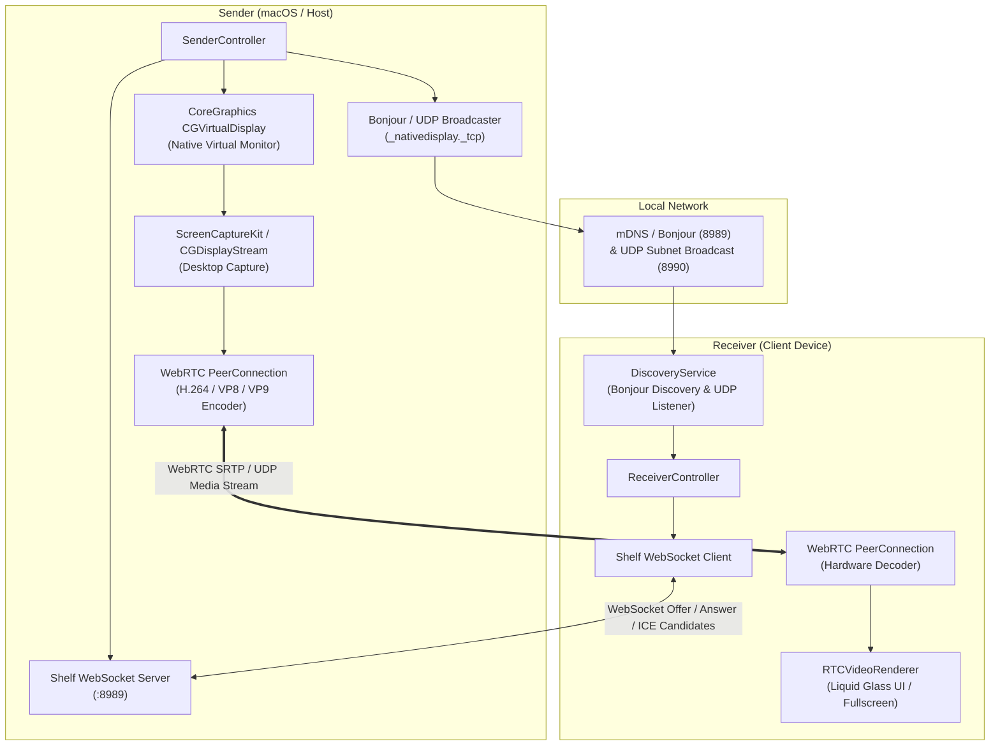

# Native Display 🖥️✨

<div align="center">

[](LICENSE)
[](https://flutter.dev)
[](https://dart.dev)
[](https://github.com/sepehrmoh81/native_display)
[](https://webrtc.org)
[](test/native_display_test.dart)
[](lib/l10n)
[](#-ai-generation-notice)

**High-performance, ultra-low-latency wireless secondary monitor extension and screen mirroring built with Flutter, WebRTC, and native macOS display APIs.**

[Key Features](#-key-features) • [Technical Architecture](#-technical-architecture) • [Getting Started](#-getting-started) • [Quality Presets](#-quality-presets) • [Project Structure](#-project-structure) • [License](#-license)

</div>

---

> [!NOTE]
> ### 🤖 AI Generation Notice
> The whole project is AI-generated and may be prone to issues. Every module—from macOS CoreGraphics private API bindings and Shelf WebSocket signaling to WebRTC peer-to-peer pipelines and Cupertino Liquid Glass UI—was crafted with automated AI assistance.

---

## 🌟 Key Features

- **🖥️ macOS Virtual Display Extension**: Creates real macOS virtual displays using private CoreGraphics (`CGVirtualDisplay`) APIs. macOS treats the stream as a physical monitor, allowing full desktop workspace arrangement, custom resolutions, and Retina HiDPI scaling without physical dummy plugs.
- **⚡ Ultra-Low-Latency WebRTC Streaming**: Peer-to-peer streaming powered by WebRTC with hardware-accelerated H.264 encoding and decoding, delivering up to 165Hz/240Hz desktop mirroring with sub-frame response times.
- **🚀 High Refresh Rates & Auto-Detection**: Supports 60 Hz, 120 Hz (ProMotion), 144 Hz, 165 Hz, and 240 Hz. Receivers dynamically detect their physical monitor resolution and native refresh rate, broadcasting accurate specifications to automatically match the virtual display.
- **🎬 Fluid Motion Optimization**: Configures WebRTC RTP sender degradation preference to `maintain-framerate`, eliminating aggressive frame drops during window movement, gaming, and rapid scrolling.
- **🔍 Zero-Config Local Discovery**: Automatic device discovery over local Wi-Fi and mobile hotspots using Bonjour / mDNS (`_nativedisplay._tcp`), backed by an automatic UDP broadcast fallback.
- **💎 Apple HIG Liquid Glass UI**: Clean, glassmorphic Cupertino interface inspired by Apple Human Interface Guidelines, complete with dynamic backdrop blurs, dark/light theme switching, and fluid controls.
- **📊 Real-Time Diagnostics HUD**: Live telemetry calculating instantaneous network throughput (Mbps), frame rate (FPS), round-trip time (RTT), packets lost, active codec, and WebRTC ICE connection states.
- **🌍 Full Multilingual Support (i18n)**: Out-of-the-box localization in **English**, **Spanish** (*Español*), and **German** (*Deutsch*).
- **📌 System Tray & Menu Bar Companion**: Desktop menu bar and system tray integration via `tray_manager` and `window_manager` to maintain streaming in the background without cluttering the dock.
- **📺 Receiver Fullscreen & Multi-Screen**: Dedicated receiver view with smooth fullscreen toggling and aspect-ratio-preserving rendering.

---

## 🏗️ Technical Architecture

Native Display operates via a modular, decoupled architecture consisting of three core pillars: **Peer Discovery**, **Signaling & Negotiation**, and **Media Transport**.



### 1. Native Virtual Display Bridge (`macos/Runner`)
- **`CGVirtualDisplayPrivate.h`**: Interfaces with the private macOS CoreGraphics `CGVirtualDisplay` and `CGVirtualDisplayDescriptor` classes.
- **Method Channel**: `com.nativedisplay.app/virtual_display` exposes display creation, destruction, resolution tuning, and display arrangement shortcuts directly to Flutter.
- **Permission Checking**: `com.nativedisplay.app/screen` manages `CGPreflightScreenCaptureAccess` and triggers macOS System Settings for Screen Recording permissions.

### 2. Peer Discovery (`lib/core/network`)
- **Bonjour / mDNS**: Uses `bonsoir` to publish and resolve `_nativedisplay._tcp` services across the local subnet.
- **UDP Broadcast Fallback**: Listens on port `8990` and broadcasts across IPv4 network interfaces, ensuring connectivity even on restrictive Wi-Fi routers or hotspot setups where multicast DNS may be filtered.

### 3. Signaling & WebRTC Pipeline (`lib/core/webrtc`)
- **WebSocket Signaling**: Embedded Dart HTTP/WebSocket server using `shelf` and `shelf_web_socket` running on port `8989`.
- **Payload Protocol**: Type-safe JSON serialization for `offer`, `answer`, `candidate`, and `bye` messages.
- **Dynamic SDP Munging (`SdpOptimizer`)**: Injects application-specific bandwidth allocations (`b=AS:<kbps>` and `b=TIAS:<bps>`), prioritizes hardware-accelerated **H.264** video payload types, and appends Google Congestion Control parameters (`x-google-min-bitrate`, `x-google-start-bitrate`, `x-google-max-bitrate`).
- **High-Framerate ScreenCaptureKit Integration**: Passes numeric integer constraints to macOS `ScreenCaptureKit` (`FlutterRTCDesktopCapturer`), unlocking full 60, 120, 144, 165, and 240 FPS capture without frame throttling.
- **RTP Sender Parameter Control**: Applies `RTCDegradationPreference.maintainFramerate`, priority flags, and dynamic bitrate ranges on `RTCRtpSender` encodings to preserve smooth framerate under network motion.
- **Instantaneous Telemetry Engine**: Computes true wire throughput in real time (`delta(bytesSent) / delta(time)` and `delta(bytesReceived) / delta(time)`) rather than displaying static preset values.

---

## 📊 Quality Presets

Native Display provides four built-in quality profiles tailored for different network environments:

| Preset | Target Resolution | Frame Rate | Bitrate | Best Used For |
| :--- | :---: | :---: | :---: | :--- |
| **Balanced** | `1920 x 1080` (1080p) | 60 FPS | 15 Mbps | Standard Wi-Fi, general productivity |
| **Fidelity** | `2560 x 1440` (1440p) | 60 FPS | 25 Mbps | High-res text rendering & graphic design |
| **Ultra** | `3840 x 2160` (4K) | 60 FPS | 45 Mbps | High-speed 5GHz / 6GHz LAN or Ethernet |
| **Economy** | `1280 x 720` (720p) | 30 FPS | 5 Mbps | Constrained networks, mobile hotspots |

---

## 🚀 Getting Started

### Prerequisites
- **Flutter SDK**: `>= 3.13.1` (channel `stable`)
- **Dart SDK**: `>= 3.13.1 < 4.0.0`
- **macOS**: macOS 12 Monterey, 13 Ventura, 14 Sonoma, or 15 Sequoia (for virtual display hosting)
- **Xcode**: 15+ (for macOS / iOS builds)

### Installation & Run

1. **Clone the repository**:
   ```bash
   git clone https://github.com/sepehrmoh81/native_display.git
   cd native_display
   ```

2. **Install Flutter dependencies**:
   ```bash
   flutter pub get
   ```

3. **Run unit & widget tests**:
   ```bash
   flutter test
   ```

4. **Launch the application on macOS**:
   ```bash
   flutter run -d macos
   ```

5. **Screen Recording Permissions (macOS Sender)**:
   When streaming from macOS for the first time, grant permission in:
   `System Settings` ➔ `Privacy & Security` ➔ `Screen Recording` ➔ enable **Native Display**.

---

## 📁 Project Structure

```
native_display/
├── lib/
│   ├── main.dart                          # App initialization, window management, tray setup
│   ├── core/
│   │   ├── constants/app_constants.dart   # Ports, presets, and channel definitions
│   │   ├── network/                       # Bonjour discovery, UDP fallback & WebSocket signaling
│   │   ├── theme/                         # Cupertino Apple HIG & Liquid Glass theme
│   │   ├── tray/                          # Menu bar & system tray controller
│   │   └── webrtc/                        # PeerConnection, SdpOptimizer & stream telemetry
│   ├── features/
│   │   ├── diagnostics/                   # Telemetry overlay (RTT, bitrate, FPS, packets)
│   │   ├── receiver/                      # Remote display receiver view & controls
│   │   ├── sender/                        # Screen source selection & virtual display controls
│   │   └── settings/                      # Preferences, quality presets & language selector
│   ├── l10n/                              # Localizations (en, es, de)
│   └── native/                            # MethodChannels for virtual display & screen capture
├── macos/
│   └── Runner/
│       ├── AppDelegate.swift              # CoreGraphics virtual display & screen capture bridge
│       └── CGVirtualDisplayPrivate.h      # macOS private virtual display header
└── test/
    └── native_display_test.dart           # Unit, serialization, controller, and UI tests
```

---

## 🧪 Testing

The test suite covers message serialization, controller state transitions, preset logic, internationalization, and UI rendering across platforms:

```bash
flutter test
```

Expected output:
```
00:00 +0: SdpOptimizer Tests injects bandwidth limits, reorders H264, and adds Google bitrate params
00:00 +1: SdpOptimizer Tests handles empty and audio-only SDP gracefully
00:00 +2: SignalingMessage Tests serializes and deserializes Offer message correctly
00:00 +3: SignalingMessage Tests serializes and deserializes Candidate message correctly
00:00 +4: PeerDevice Tests correctly decodes PeerDevice JSON
00:00 +5: SettingsController Tests updates quality preset and propagates bitrate and fps
00:00 +6: SettingsController Tests toggles hardware acceleration and low latency
00:00 +7: SettingsController Tests manages locale selection
00:00 +8: SettingsController Tests manages virtual resolution presets and dimension resolving
00:00 +9: Localization & Translation Tests verifies English, Spanish, and German AppLocalizations
00:00 +10: UI & Cupertino Widget Tests renders LiquidGlassSurface properly
00:00 +11: UI & Cupertino Widget Tests renders localized CupertinoApp in Spanish and German
00:00 +12: UI & Cupertino Widget Tests renders disabled macOS-only placeholder when SenderView is opened on non-macOS
00:00 +13: UI & Cupertino Widget Tests MainShellView dims Extend Display and defaults to Receiver when isMacOverride is false
00:00 +14: All tests passed!
```

---

## 🌐 Internationalization (i18n)

Native Display includes localization support configured with `.arb` files:
- 🇺🇸 **English** (`en`)
- 🇪🇸 **Spanish** (`es`)
- 🇩🇪 **German** (`de`)

Language preferences can be switched on the fly in the Settings tab.

---

## 📄 License

This project is licensed under the **MIT License**. See the [LICENSE](LICENSE) file for details.
